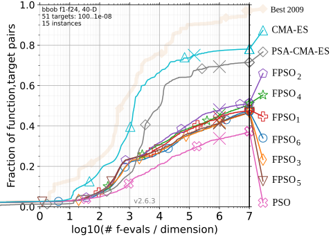

## Benchmarking

## Internal benchmarks

| Algorithm   | File                   |Notes   |
|-------------|------------------------|--------|
| APSO-VI     | scripts/ext-apso-vi.py | Own implementation |
| PSO-RIW     | scripts/ext-pso-riw.py | Own implementation |
| CMA-ES      | scripts/ext-cma.py     | Using pycma [pycma](https://github.com/CMA-ES/pycma)|
| GA          | scripts/ext-ga-de.py   | Using [geneticalgorithm](https://github.com/rmsolgi/geneticalgorithm) |
| L-SHADE     | scripts/ext-shade.py   | Own implementation instead of [PyADE](https://github.com/xKuZz/pyade) because it wasn't correct.|
| FPSO        | scripts/fpso.py        | Using [Hybris](https://github.com/Kaeryv/Hybris) |

The PyADE implementation of L-SHADE had very poor performance which was strange.
We translated the matlab code from the original author for this benchmark.

## BBOB Benchmark

To launch a COCO benchmark on BBOB, use `scripts/bbob.py`.
The figures of a previous run are found in `./bbob_noiseless/`.

## Set of controllers

A sample of trained controllers is provided in folder `controllers`.
They can be used in the FPSO benchmark script or analyzed any way you want.

## Dataset

| Path       | In the article |                                   | Filename meaning                     |
|------------|----------------|-----------------------------------|--------------------------------------|
| db/tables/ | Tables 7 & 8   | Used for accuracy and consistency | {bench}_{dims}_{fevals}_{method}.npz |

## Training new controllers

This can be done using `scripts/fpso-train.py`.
